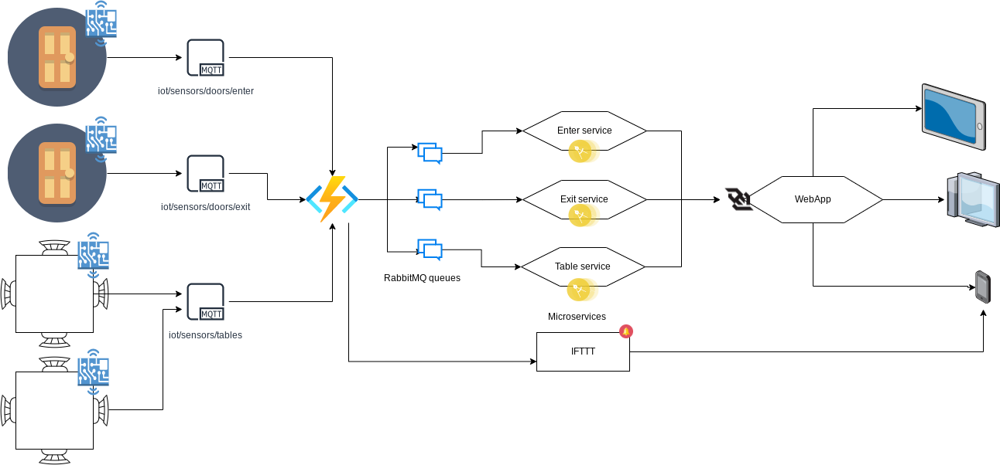

# **COVOID19 - ANTI CROWD SYSTEM**

Due to Covid-19 restriction, people can’t access to public places more than a fixed number per square meter, same for locals with seating area and at the same time every place must have one door to get into and one door for exiting, for this reason it’s very important to count how many people access to a specific public place (e.g. bars, shops, restaurants, gyms)

## What is CVOID19 ?
CVOID19 is designed to count:
- how many people are inside (assuming that people enter one by one) a public place by positioning a sensor on the doors
- how many people are sitting, by positioning a pressure (force) sensor under the chairs.
Ones a place reach the maximum capacity, the C-Void system will send a notification to warn the business owner, to prevent people to access to the place. This system has also a public front end to allow the clients to check how many people are inside.

## How CVOID19 works ?
Sensors will publish data on different topics, after processing the data, users will be able to see the data through a small web application. Doors sensors have only open/close status, while pressure (force) sensors produce decimal number representing the force applied on the sensor.


The web application display, in real time, how many people are inside and how seats are occupied

# Project architecture



# Project structure

- [`WebApp/`](./WebApp/), this folder contains the ReactJS web client
- [`Serverless/`](./Serverless/), this folder contains the `.yaml` files that defines the Nuclio functions (Env vars, triggers, code) and their source code
    - [`functions/`](./Serverless/functions/), this folder contains the source code for the serverless function
    - [doorconsume_enter.yaml](./Serverless/functions/doorconsume_enter.yaml), defines a serverless function triggered when a new message is posted on the `iot/sensors/doors/enter` MQTT queue. This function read the value, create a RabbitMQ queue (`iot/rmq/enter`) and post a message on the new created queue.
    - [doorconsume_exit.yaml](./Serverless/functions/doorconsume_exit.yaml), defines a serverless function triggered when a new message is posted on the `iot/sensors/doors/exit` MQTT queue. This function read the value, create a RabbitMQ queue (`iot/rmq/exit`) and post a message on the new created queue.
    - [tableconsume.yaml](./Serverless/functions/tableconsume.yaml), defines a serverless function triggered when a new message is posted on the `iot/sensors/tables` MQTT queue. This function read the value, create a RabbitMQ queue (`iot/rmq/tables`) and post a message on the new created queue.
    - [iftttnotify.yaml](./Serverless/functions/iftttnotify.yaml), defines a serverless function triggered every minutes that check how many people are inside, if the number is greater then the limit it send a notificatin through IFTTT
- [`Microservices/`](./Microservices/), this folder contains the microservices source code
    - [`EnterService/`](./Microservices/EnterService), this folder contains the code triggered when a message is posted on the `iot/rmq/enter` RabbitMQ queue. The microservice read the message, save it on an embedded sqlite database and send a notification to the client through a WebSocket
    - [`ExitService/`](./Microservices/ExitService), this folder contains the code triggered when a message is posted on the `iot/rmq/exit` RabbitMQ queue. The microservice read the message, save it on an embedded sqlite database and send a notification to the client through a WebSocket
    - [`TableService/`](./Microservices/TableService), this folder contains the code triggered when a message is posted on the `iot/rmq/tables` RabbitMQ queue. The microservice read the message, send a notification to the client through a WebSocket
- ['docker-compose.yaml`](./docker-compose.yml), this compose file contains all the directives to bring all the component up and running using docker containers

# Run the project

The project can be launched using `docker compose` commands inside the project root folder.

1. Create a Firebase project, then create a Realtime Database and generate a configuration key
2. Apply the following rules to the RealtimeDatabase
```
    {
        "rules": {
            ".read": true,
            ".write": "auth.uid === 'uid_for_enter_microservice' || auth.uid === 'uid_for_exit_microservice' || auth.uid === 'uid_for_table_microservice'"
        }
    }
```
3. Create a copy of [`FirebaseConfig.js.dist`](./WebApp/src/config/FirebaseConfig.js.dist) in the `WebApp` project, rename it `FirebaseConfig.js` and fill the file with the configuration obtained on the Firebase console
4. Running the ```docker compose up -d``` command will spin up three containers: 
    - `nuclio` ***localhost:8070***
    - `rabbitMQ` ***localhost:9000***
    - `WebApp` ***localhost:3000***
5. Import the serverless functions, one by one, by following the instruction on the nuclio dashboard (`http://localhost:8070`). The `.yaml` functions files are located in the [`Serverless/`](./Serverless/) folder.

***IMPORTANT: the functions define different environment variables, change them based on your settings (e.g. RabbitMQURL defines the RabbitMQ endpoint)***

6. Once imported, deploy all the function, by clicking the "Deploy" button.

7. In each [`Microservices/`](./Microservices/) subfolder there is a `.env.dist` file, make a copy and rename it to `.env`, then edit the file with the proper values:
    - **RABBITMQURL**, is the RabbitMQ endpoint
    - **QUEUENAME**, is the RabbitMQ name, you can use the one defined in the nuclio function
    - **UID**, is one difined in the Realtime Database rules (pt. 2)
    - **FIREBASEDATABASEURL**, is the Realtime Database url
8. For each [`Microservices/`](./Microservices/) subfolder, locate the folder ***/dist*** and duplicate and rename each file in ***cvoid19.json*** and ***sqlite.db***. Then fill the ***cvoid19.json*** file with the proper configuration.

9. Before start the microsevice send an empty message on each MQTT queue (this step is mandatory in order to create the proper RabbitMQ queues)

10. Start the microservices by running the command ``` docker compose --profile microservices up ```

11. Post a new message on the MQTT queues
    - For the doors queues the JSON message follow this structure:
        ```
            {
                "status":"open/close"
            }
        ```
    - For the tables queue the JSON message follow this structure:
        ```
            {
                "table":"1/2/3/4",
                "seat":"1/2/3/4",
                "status":"0/1.x"
            }
        ```